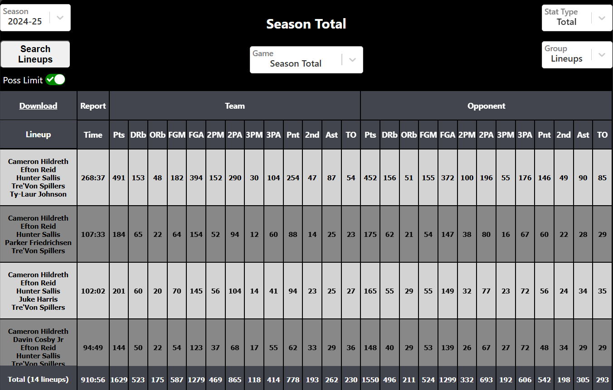
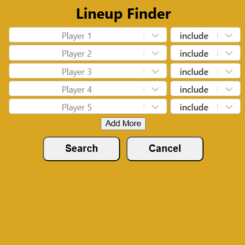
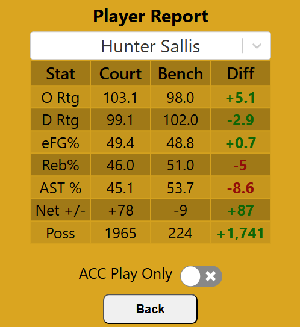

# Lineup Data Viewer

A convenient way to view lineup data from the Wake Forest Basketball team. Its like BBallRef, but for lineups.

Site is live [here](https://awbridgers.github.io/lineup-data-viewer/).

 
 ---
## Features
### Data
The viewer has the ability to show several types of data, from raw totals for Wake and their opponent to more advanced analytics.
* Use the `Season` dropdown to change the year.
* The `Game` dropdown allows the user to filter by the whole season, conference games, or individual games.
* The `Stat Type` dropdown filters by raw data, net +/-, advanced per possession data, and shooting data.
* The `Group` dropdown switches between lineups, individual players, and year-to-year. The individiual stats are stats for the TEAM while that player is on the court. The year-to-year data is the team as a whole for an entire season.
* The `Poss Limit` switch will filter out any lineups that didn't meet the possession requirement of 1 possession per game.
### Lineup Finder

Hit the `Search Lineups` button on the left side of the control panel to open the Lineup Finder tool. The Lineup Finder allows uses to search for all lineups that contain or omit certain players. 
1. select the player from the drop down
2. chose whether to omit or include that player
3. add more player lines as you need them with the `Add More` button
4. Hit `Search` when you are done to see filtered lineups.
5. Press `Exit Finder` at the top of the screen to return back to unfilited data. 

### Player Report

To quickly see how a player impacts the team when they are on the court, click the `Report` link available in the header of the Total Stats page. This will show how the team faired in several key analytics with that player on the court vs on the bench. You can select `ACC Play Only` to see stats only from conference play.
### Download
The `Download` button on the Total Stats page will download a copy of the raw data in a excel spreadsheet format. 
## Author 
Adam Bridgers